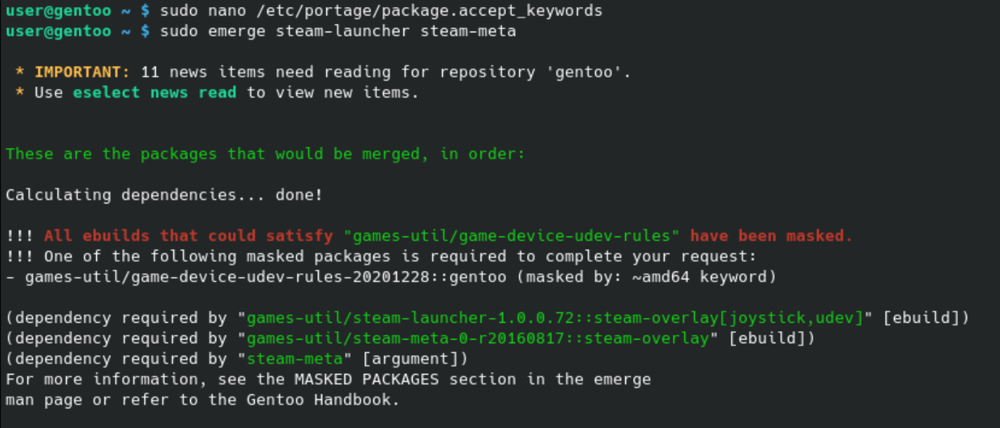
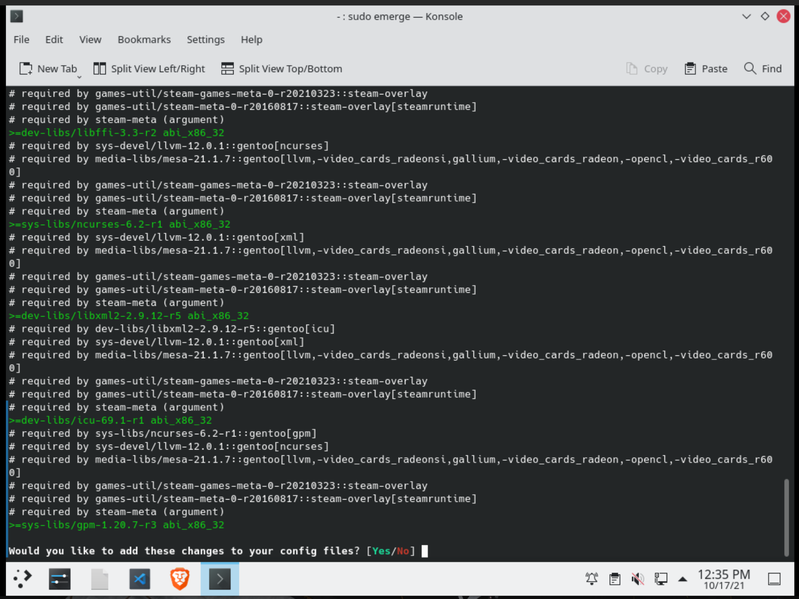
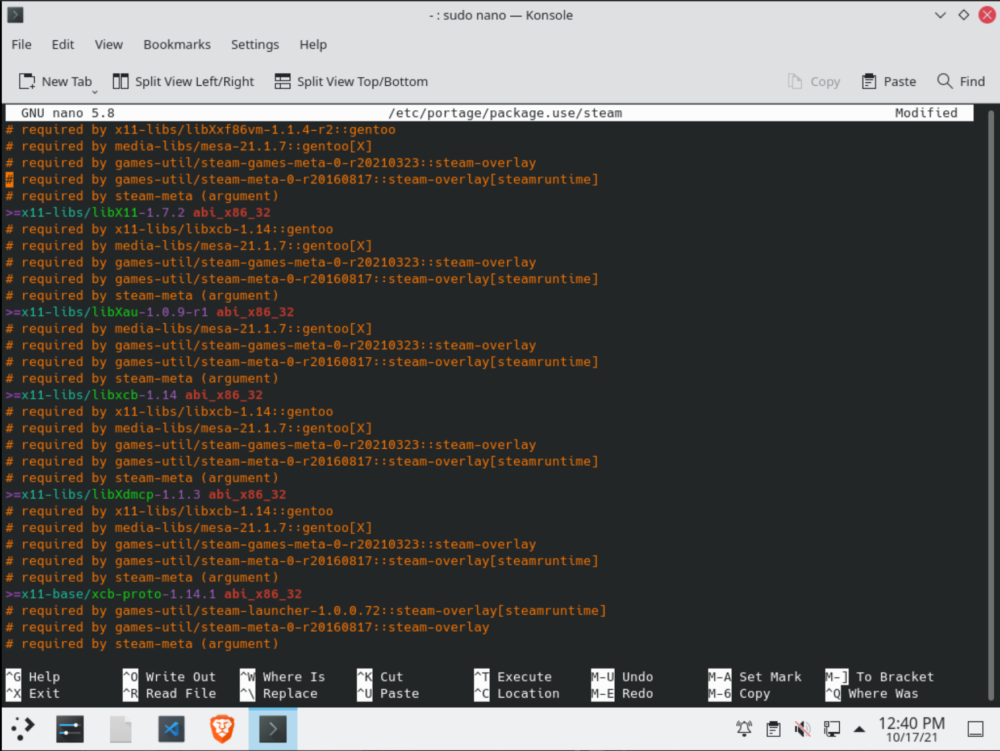
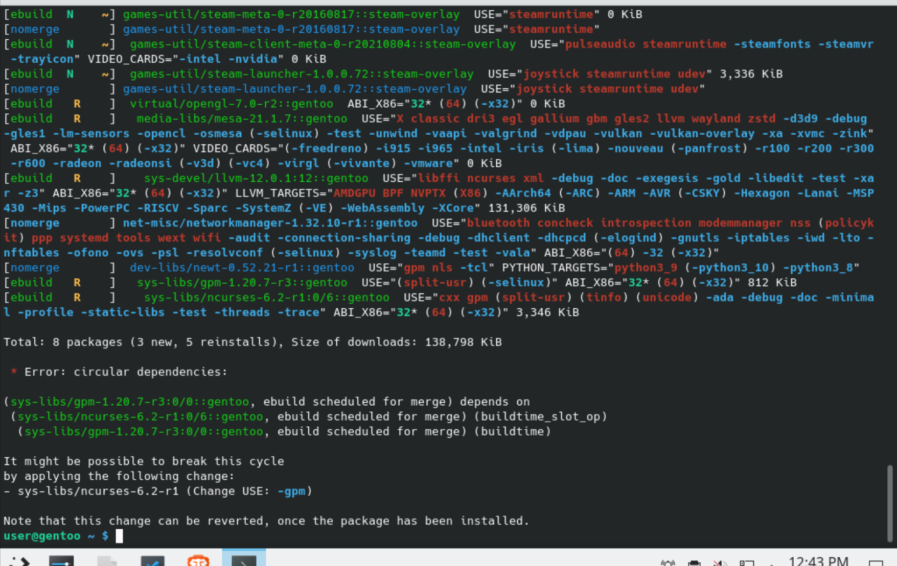
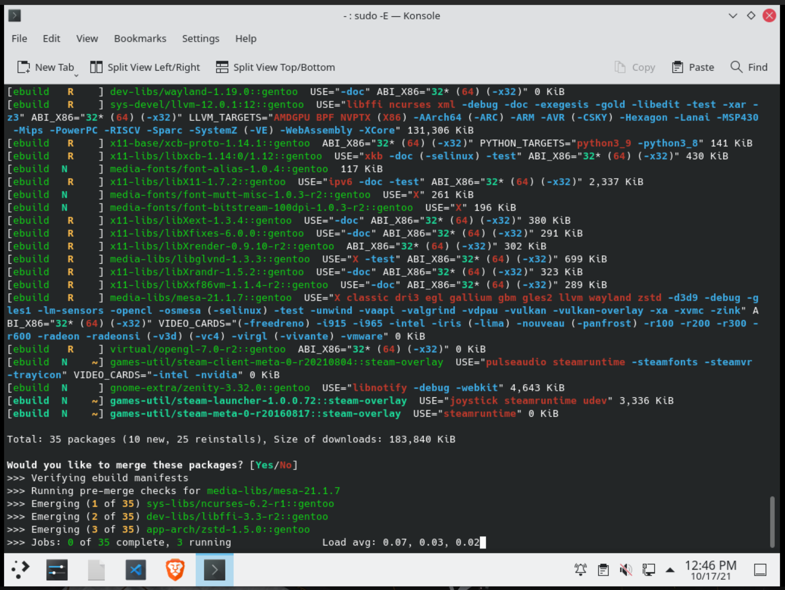

# Instalar Steam

Para instalar Steam podemos usar el `steam-overlay` tal y como viene en el [artículo en la wiki de Gentoo](https://wiki.gentoo.org/wiki/Steam). Primero tenemos que asegurarnos de tener las herramientas:

```sh
sudo emerge eselect-repository dev-vcs/git
```

Activamos el overlay, de igual forma que explicamos en la [sección anterior](README-third.md):

```sh
sudo eselect repository enable steam-overlay
sudo eix-sync
```

Como la mayoría de paquetes que vienen de repositorios de terceros están marcados como inestables/testing (para evitar romper nuestro sistema), tenemos que añadir algunos paquetes a nuestro `package.accept_keywords` para que portage nos deje instalarlos. Para añadir todos los paquetes del `steam-overlay` de golpe, podemos editar `/etc/portage/package.accept_keywords` y añadimos la línea:

```
*/*::steam-overlay
```

Necesitaremos cambiar algunas USE flags, así que probamos a instalar steam, a ver qué nos dice portage:

```sh
sudo emerge steam-launcher steam-meta
```



Portage nos dice que necesita el paquete `games-util/game-udev-rules` como inestable, del repositorio gentoo. Lo añadimos también a nuestro `/etc/portage/package.accept_keywords`:

```
*/*::steam-overlay
games-util/game-device-udev-rules
```

Si volvemos a intentar instalar steam...



Portage nos dirá que necesita cambiar USE flags. En concreto, son use flags para compilar las versiones `32 bit` de algunos paquetes. En otras distribuciones se suelen instalar con `lib32-<paquete>`, pero en Gentoo es el mismo paquete con la USE flag de lib32, así si borramos un paquete se borra también la versión de 32 bit.

Normalmente lo que haríamos sería darle a `Yes`, y después usar `sudo dispatch-conf`. Como son muchas USE flags, las vamos a gestionar a mano.

- Elegimos `No`
- Copiamos todas las líneas de encima
- Las pegamos en `/etc/portage/package.use/steam`. El nombre de archivo `steam` puede ser cualquiera.





Si volvermos a intentar instalar steam, portage puede que se queje de que tenemos dependecias circulares. Probamos a hacer lo que nos dice:

```
USE="-gpm" sudo -E emerge steam-launcher steam-meta
```



Lo que hemos hecho es temporalmente usar una USE flag diferente de forma global. Es importante usar `sudo -E` para que se pase la USE flag. Después de instalar steam, tendríamos que actualizar el sistema para reactivar esa USE flag que desactivamos temporalmente, con `sudo emerge -uDN @world` y `sudo emerge --depclean`


# Instalar Lutris

El paquete de Lutris es `games-util/lutris` y está directamente en el repositorio de `gentoo`. Podemos seguir todo lo de Steam cambiando el nombre del paquete.
