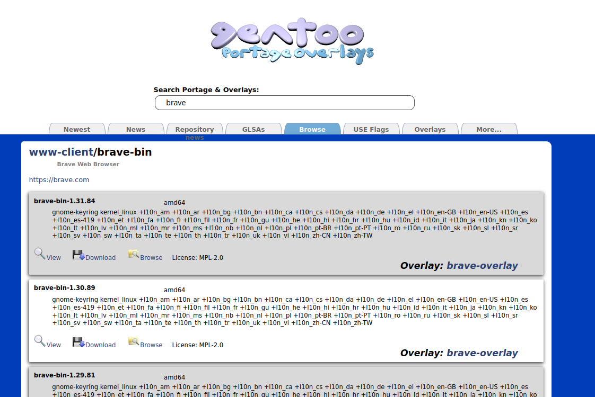
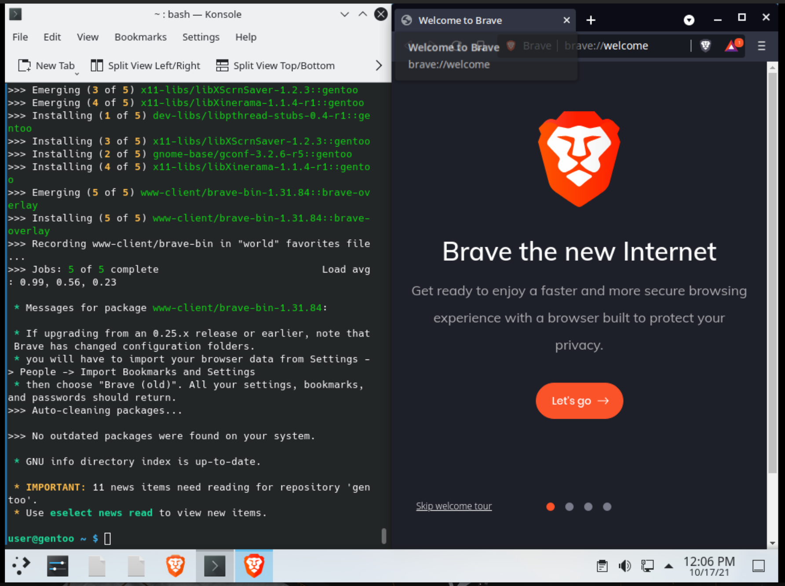
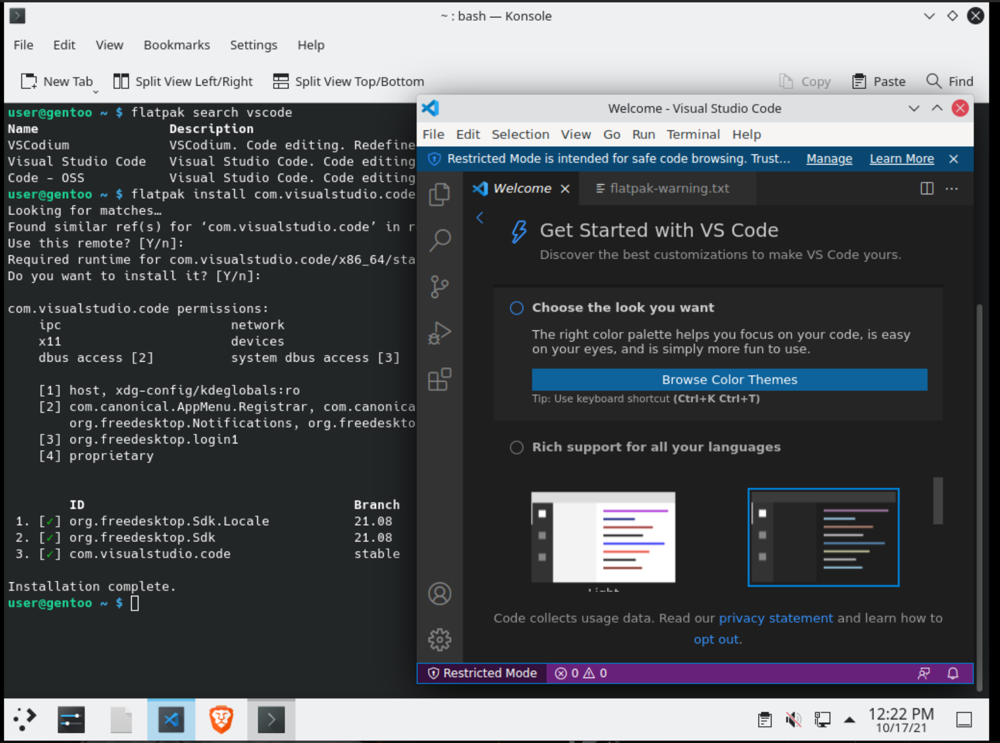

# Instalar software de terceros

Para instalar software que no esté disponible en los repositorios oficiales de Gentoo, tenemos varias opciones.


## Overlays

Un overlay es un repositorio más del que portage puede sacar paquetes, hecho por la comunidad en vez ser oficial de Gentoo.

Para poder buscar paquetes en los overlays, usamos la página https://gpo.zugaina.org. Por ejemplo, vamos a instalar el navegador Brave.



Buscando en la web por brave, encontramos el paquete `www-client/brave-bin`. Vemos que lo podemos encontrar en el `brave-overlay`. Para gestionar overlays necesitamos antes en nuestro sistema:

```sh
sudo emerge eselect-repository dev-vcs/git
```

Activamos y descargamos el overlay (repositorio):

```sh
sudo eselect-repository enable brave-overlay
sudo eix-sync
```

Instalamos el paquete:
```sh
sudo emerge brave-bin
```

> Nota: muchos de los paquetes de los overlays de terceros estarán marcados como inestables (~amd64). En [post instalación](README-post.md) explicamos como instalar estos paquetes al igual que los paquetes que vienen directamente de Git (versión `-9999`)




## Flatpak

Flatpak es un sistema de paquetes con el que se distribuyen las liberías necesarias separadas de las libererías del sistema, de forma que los paquetes Flatpak funcionan de forma más independiente del sistema.

Para instalar flatpak y añadir el repositorio de flathub:

```sh
sudo emerge flatpak
flatpak remote-add --user --if-not-exists flathub https://flathub.org/repo/flathub.flatpakrepo
```
Después podemos instalar y aplicaciones como en cualquier distribución de linux con flatpak:

```sh
flatpak install <programa>
```




## Local overlay

To-do
