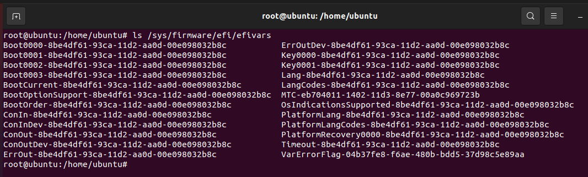
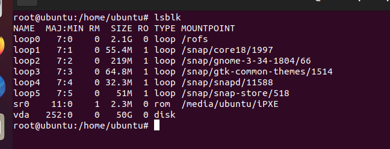
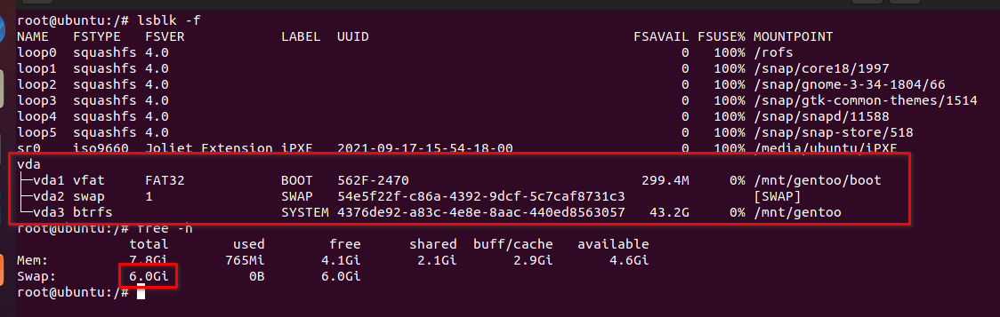
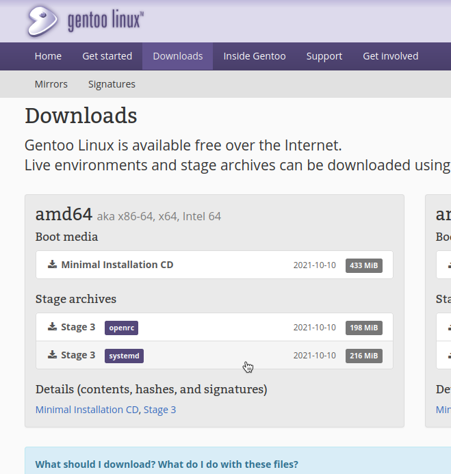
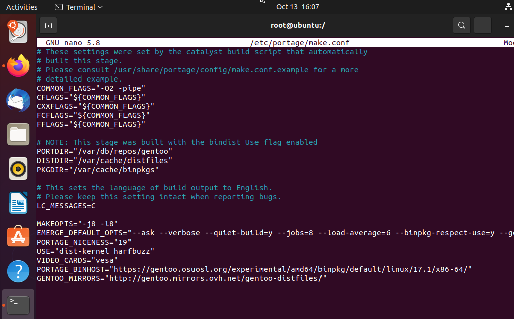
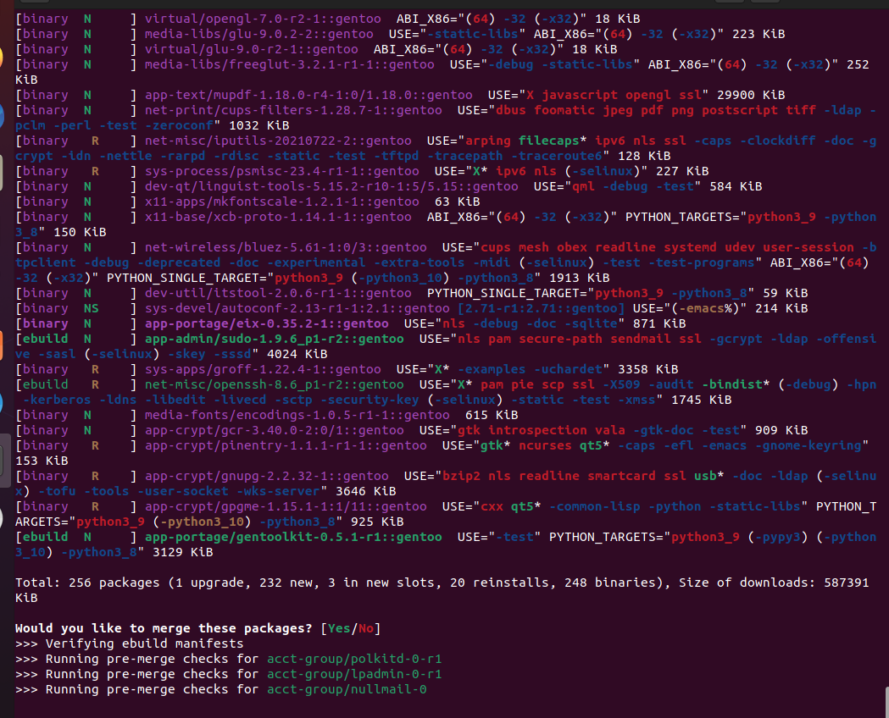
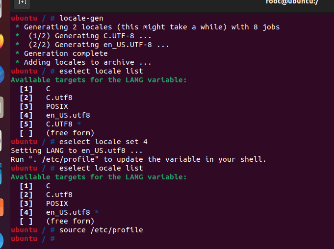
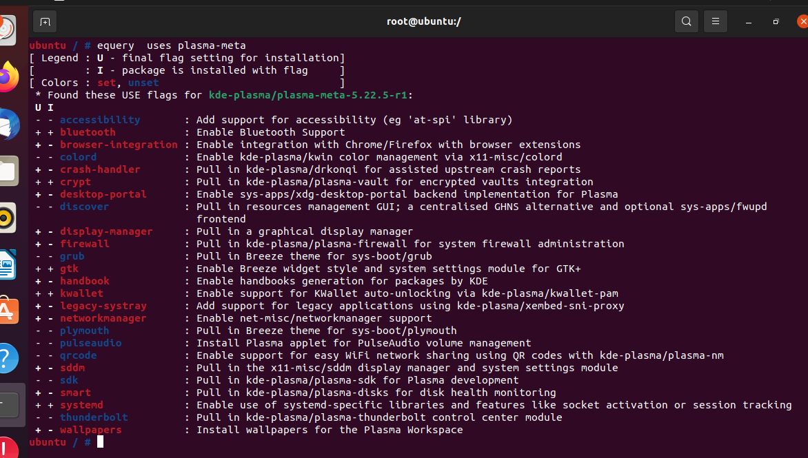
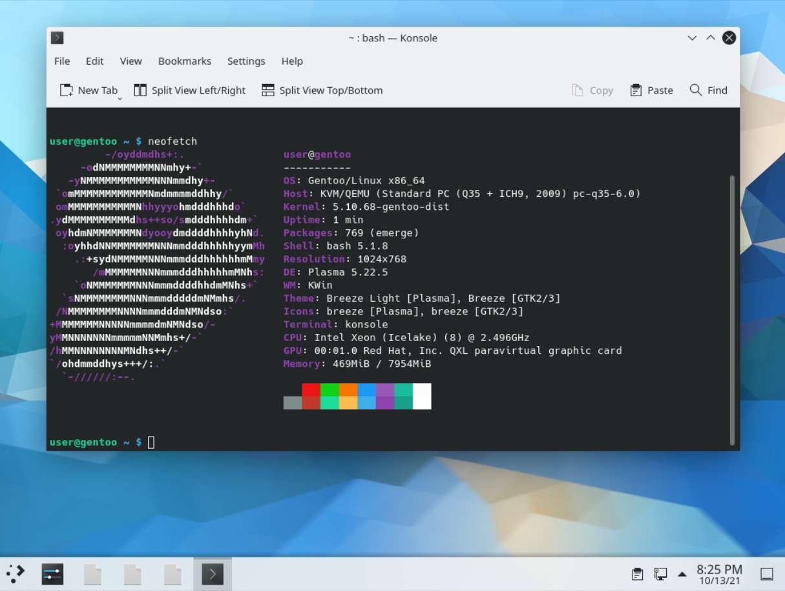

<!-- Inssert gentoo logo -->


# Guia de instalación de Gentoo en español

- [Guia de instalación de Gentoo en español](#guia-de-instalación-de-gentoo-en-español)
- [0. Conseguir el medio de instalación](#0-conseguir-el-medio-de-instalación)
- [1. Preparar los discos](#1-preparar-los-discos)
- [2. Instalar el sistema base](#2-instalar-el-sistema-base)
  - [Instalar la stage3](#instalar-la-stage3)
  - [Configurar portage/make.conf](#configurar-portagemakeconf)
  - [Actualizar los paquetes](#actualizar-los-paquetes)
- [3. Configurar systemd](#3-configurar-systemd)
- [4. Instalar el kernel](#4-instalar-el-kernel)
- [5. Instalar el Bootloader](#5-instalar-el-bootloader)
- [6. Instalar NetworkManager](#6-instalar-networkmanager)
- [7. Crear cuentas](#7-crear-cuentas)
- [8. Instalar KDE Plasma](#8-instalar-kde-plasma)
- [9. Salir](#9-salir)

Esta guía expone cómo instalar Gentoo rápidamente, usando paquetes binarios. Gentoo es una distribución que pone su énfasis en las opciones. El manual oficial de Gentoo sobre la instalación
es un buen recurso para conseguir un sistema Gentoo, pero como el propio manual explica, muchos pasos tienen varias opciones a elegir por el usuario, y se han elegido
las opciones más convenientes para la mayoría de casos. Por lo tanto, en esta guía se proponen otra serie de pasos a seguir, no como una alternativa "mejor" al
handbook, sino eligiendo otras opciones que pueden ser de interés para un usuario nuevo en Gentoo.

Se cubrirá una instalación de Gentoo dirigida a un PC de sobremesa para uso corriente (no para uso en servidor o en arquitecturas más exóticas), con las siguientes características:

- Paquetes binarios de la rama estable
- KDE Plasma como entorno de escritorio
- Systemd en vez de OpenRC
- BTRFS como sistema de almacenamiento
- Arquitectura x86_64
- UEFI + GPT

Si alguna vez has realizado una instalación de Arch Linux, esta guía debería ser igual o más fácil de seguir. Si sólo has hecho instalaciones con interfaces gráficas, te recomiendo hacer esta instalación antes en una máquina virtual para probar.


# 0. Conseguir el medio de instalación

Para la instalación de Gentoo no hace falta usar el Live System de Gentoo, sirve cualquier distro de Linux. En este tutorial usaré el [Live System de Ubuntu](https://ubuntu.com/download/desktop),
porque ofrece un entorno gráfico para abrir Firefox, usar el ratón en la terminal, copiar y pegar los comandos, etc.

Teniendo la ISO y el pendrive, con el programa [Balena Etcher](https://www.balena.io/etcher/), se flashea la ISO en el pendrive, apagamos el PC y lo iniciamos desde
el pendrive.

Si estamos en una máquina virtual, añadimos la ISO y arrancamos desde ahí. También tenemos que asegurarnos
de que el arranque del sistema sea con UEFI y no MBR.

> NOTA: si el sistema tiene Windows ya instalado, hay que desactivar el arranque rápido de Windows.

Abrimos una terminal, y cambiamos al superusuario para ejecutar todos los comandos:
```sh
sudo -s
```

Verificamos que hemos arrancado con UEFI (si no es el caso, el directorio estará vació):
```sh
ls /sys/firmware/efi/efivars
```




# 1. Preparar los discos

Lo primero es crear las particiones para nuestro sistema operativo. El formato de archivos será BTRFS. Ya está siendo adoptado por Fedora y ofrece una serie de características muy buenas, como compresión transparente, subvolúmenes, snapshots, etc.

Para identificar nuestro disco, podemos usar el comando `lsblk`:



El identificador de nuestro disco será `sd__` para un disco común, `vd__` para un disco virtual, `nvme____` para NVME. Irá seguido de `a, b, c...` si tenemos varias discos del mismo tipo, y de `1, 2, 3...` si ya tenemos varias particiones. Para el NVME será `p1, p2, p3` para las particiones.

En este tutorial, el disco será `/dev/vda`, por favor cambia el nombre por tu disco en todos los pasos (por ejemplo, `/dev/vda2` por `/dev/sda2` o `/dev/nvme0n1p2`)

Vamos a borrarlo enteramente, creando una nueva tabla de particiones GPT:

- Partición 1: EFI de 300MB
- Particion 2: SWAP de 6GB
- Partición 3: sistema

El tamaño de la Swap puede ser el que quieras, existen muchos artículos que discuten cuánto elegir. Como regla fácil, elegir uno de estos:

- \>6GB de swap para poder compilar paquetes grandes con más seguridad
- \>3/4 de la RAM en swap para poner el sistema en suspensión
- 0GB de swap si tenemos >34GB de RAM

Para particionar el disco existen varias herramientas. Una de ellas es `cfdisk`, que ofrence un entorno visual, pero que es más dicícil de escribir en tutoriales, por lo que usaremos `fdisk`.

```sh
fdisk /dev/vda
```
- Con h sacamos el manual de fdisk
- Usamos el comando `g`, para crear una nueva tabla de particiones.
- Con `n`, creamos una nueva partición. El primer sector será por defecto y el último será el tamaño de la partición (`+300M` y `+6G`)
- Con `t` elegimos el tipo (tipo `1` para EFI, tipo `19` para swap, tipo `20` para el sistema)
- Con `w` guardamos la tabla de particiones.

Aplicamos los formato de almacenamiento a las particiones. También usaremos nombres en las particiones para poder gestionarlas más fácilmente:

```sh
mkfs.vfat -F32 -n BOOT /dev/vda1
mkswap -L SWAP /dev/vda2
mkfs.btrfs -L SYSTEM /dev/vda3
```
Para el sistema BTRFS, vamos a crear un par de subvolúmenes, `@gentoo` y `@home`. Esto nos permite aplicar diferentes configuraciones a los archivos de usuario y de sistema, poder hacer copias de seguridad por separado, etc. Montaremos primero la partición BTRFS, aplicamos los subvolúmenes y la desmontamos:

```sh
mount /dev/vda3 /mnt/
cd /mnt
btrfs subvolume create @gentoo
btrfs subvolume create @home
btrfs subvolume set-default \@gentoo
cd /
umount -R /mnt
```

Finalmente montamos todas las particiones en `/mnt/gentoo`:
```sh
mkdir /mnt/gentoo
mount -o compress=lzo,space_cache,noatime /dev/vda3 /mnt/gentoo
mkdir /mnt/gentoo/{boot,home}
mount -o compress=lzo,space_cache,noatime,subvol=@home /dev/vda3 /mnt/gentoo/home
mount /dev/vda1 /mnt/gentoo/boot
swapon /dev/vda2
```



Si has llegado hasta aquí, las particiones de deberían ver así.


# 2. Instalar el sistema base

## Instalar la stage3

El "stage3" es como se conoce a una instalación mínima de Gentoo que se descomprime directamente al disco. A partir de este stage3, se puede instalar todo el sistema.

Visitamos la página de descargas de Gentoo desde nuestro navegador (https://www.gentoo.org/downloads/), hacemos click derecho en `Stage 3 systemd` \> Copiar enlace. Es muy importante no equivocarse con la stage3 de `openrc`.



Desde nuestra terminal, navegamos hasta `/mnt/gentoo` y descargamos y descomprimimos la stage3 dentro:

```sh
cd /mnt/gentoo
wget "<link que hemos copiado>"
tar xpvf stage3-*.tar.xz --xattrs-include='*.*' --numeric-owner
```

## Configurar portage/make.conf

Ahora vamos a hacer una primera configuración de nuestro `make.conf`. Es el principal archivo con el que configuramos portage, el gestor de paquetes de Gentoo. Antes necesitamos saber el número de procesadores lógicos que tiene nuestro PC usando el comando `nproc`. En este caso es `8`. Sustituir por la salida del comando `nproc`.

> Nota: de ahora en adelante, cada vez que editemos un archivo `/ruta/al/archivo`, estaremos ejecutando `nano /ruta/al/archivo`...

Editamos `/mnt/gentoo/etc/portage/make.conf` (he añadido las explicaciones de cada línea, no es algo que añadir):

- `MAKEOPTS="-j8 -l8"`
  > Compilar un paquete con varios hilos en paralelo
- `EMERGE_DEFAULT_OPTS="--ask --verbose --quiet-build=y --jobs=8 --load-average=6 --binpkg-respect-use=y --getbinpkg=y --with-bdeps=y"`
  > Opciones por defecto para pasar a portage. En load average, usar `nproc - 2`, en este caso `8 - 2 = 6`
- `PORTAGE_NICENESS="19"`
  > Dar la prioridad más baja a portage, para que podamos usar el PC normalmente
- `USE="dist-kernel harfbuzz"`
  > Con las USE flags controlamos características de los paquetes (más explicación al final). Con dist-kernel preparamos para usar un kernel precompilado, harfbuzz previene algunos errores durante la instalación.
- `ACCEPT_LICENSE="*"`
  > Aceptar todas las licencias, por defecto sólo se aceptan licencias libres
- `VIDEO_CARDS="  "`
  > Rellenamos, dependiendo de nuestra tarjeta gráfica con uno de: `intel nvidia radeon vesa`
- `PORTAGE_BINHOST="https://gentoo.osuosl.org/experimental/amd64/binpkg/default/linux/17.1/x86-64/"`
  > A la hora que se creo esta guía, es el primer mirror público de Gentoo de paquetes binarios
- `GENTOO_MIRRORS="  "`
  > Rellenamos con un mirror http de la lista de mirrors oficiales https://www.gentoo.org/downloads/mirrors/




Configuramos los repositorios de gentoo con:

```sh
mkdir -p /mnt/gentoo/etc/portage/repos.conf
cp /mnt/gentoo/usr/share/portage/config/repos.conf /mnt/gentoo/etc/portage/repos.conf/gentoo.conf
```

## Actualizar los paquetes

A partir de ahora, nos metemos en un chroot del sistema. Es decir, los comandos afectarán al sistema "dormido" en `/mnt/gentoo` en vez de al host Ubuntu.

```sh
cp --dereference /etc/resolv.conf /mnt/gentoo/etc/
mount --types proc /proc /mnt/gentoo/proc
mount --rbind /sys /mnt/gentoo/sys
mount --make-rslave /mnt/gentoo/sys
mount --rbind /dev /mnt/gentoo/dev
mount --make-rslave /mnt/gentoo/dev
mount --bind /run /mnt/gentoo/run
mount --make-slave /mnt/gentoo/run

chroot /mnt/gentoo /bin/bash
source /etc/profile
```

Una vez dentro del chroot, lo primero que vamos a hacer es actualizar los paquetes y cambiar el perfil.

Para actualizar el repositorio, ejecutamos:

```sh
emerge --sync
```

Lo que hará el comando será descargar las "ebuild" a `/var/db/repos`. Las ebuild son aproximadamente el equivalente de un paquete en otra distribución. Como en Gentoo se compilan los paquetes, las ebuild son simples carpetas y archivos de texto que contienen las instrucciones para compilar los programas (serían el equivalente en Arch Linux de las `PKGBUILD`). Como hemos configurado nuestro `BINHOST`, las ebuild sólo se usarán si no existen un paquete binario ya compilado en el servidor.


Muy importante antes de continuar, tenemos que elegir un perfil de portage, que acabamos de descargar junto con las ebuild. Los perfiles son unas "plantillas" de configuraciones, que facilitan instalar el sistema. Con la stage3 tendremos elegida una plantilla base, pero debemos elegir la plantilla `default/linux/amd64/17.1/desktop/plasma/systemd` (la última a esta fecha)

```sh
eselect profile set "default/linux/amd64/17.1/desktop/plasma/systemd"
```
Ahora sí, actualizamos los paquetes que traía la stage3 e instalamos unos de paso:

```sh
emerge --update --deep --newuse @world gentoolkit eix btrfs-progs dosfstools
```



Los paquetes que se descargaran como binarios se marcan en morado, y los que se compilan en verde. Como en nuestro `make.conf`
configuramos portage para que usase paquetes binarios "respetando" nuestras USE flags, los que no coincidan con USE flags que queremos instalar con las que existen en el servidor se compilarán. No deberían ser muchos, ya que el `BINHOST` también usa el perfil `desktop/plasma/systemd`.

Durante la instalación portage se quejará por no encontrar configuraciones del kernel. Es normal, ya que aún no hemos instalado el kernel.

Para saber el estado de las descargas, desde otra pestaña de la terminal de Ubuntu:

```sh
tail -f /mnt/gentoo/var/log/emerge.log
```

# 3. Configurar systemd

Continuamos con una configuración básica de systemd. Primero elegimos nuestra zona horaria, buscando en los archivos en `/usr/share/zoneinfo`. Podemos listar todas con `ls /usr/share/zoneinfo/*/* | less`. En mi caso, es
`Europe/Madrid`, la elijo con:

```sh
ln -sf /usr/share/zoneinfo/Europe/Madrid /etc/localtime
```

Elegimos el idioma de nuestro sistema editando el archivo `/etc/locale.gen`, y añadimos en otra línea:

```
en_US.UTF-8 UTF-8
```

Si queremos añadir otro idioma aparte del inglés americano, podemos sacar la lista de todos los disponibles
con `ls /usr/share/i18n/`. Usar las versiones UTF-8.

Una vez editado el archivo `/etc/locale.gen`, ejecutamos el comando:
```sh
locale-gen
```
...y elegimos el idioma con `eselect locale list` y `eselect locale set`.



Después de cambiar el idioma regeneramos nuestro entorno con
```sh
source /etc/profile
```

Cambiamos el nombre de nuestro pc con el comando siguiente (poner entre comillas el nombre que queramos):

```sh
echo "gentoo" > /etc/hostname
```

A continuación activamos por defecto algunos servicios servicios de systemd con:

```sh
systemd-machine-id-setup
systemctl preset-all
systemctl enable systemd-timesyncd
```
Por último, debemos editar nuestro
`/etc/fstab`, que es un archivo que le dice a systemd cómo montar nuestros discos. Como al hacer las particiones hemos usado labels, las podemos usar aquí.


```
LABEL=BOOT      /boot   vfat    defaults        1 2
LABEL=SWAP      none    swap    sw              0 0
LABEL=SYSTEM    /       btrfs  	compress=lzo,space_cache,noatime,subvol=@gentoo         0 0
LABEL=SYSTEM    /home   btrfs   compress=lzo,space_cache,noatime,subvol=@home           0 0
```

El resto del archivo `/etc/fstab` con comentarios lo podemos borrar o dejar ahí.


# 4. Instalar el kernel

En Gentoo existen diferentes formas de instalar el kernel. Si queremos instalar un kernel para compilar, lo que hace el paquete de kernel el instalar el código fuente en `/usr/src/linux`, y después el usuario lo compila a mano (o con genkernel) y genera el initramfs y módulos por su cuenta.

Sin embargo ,el paquete binario el kernel se instala directamente como en las distribuciones de Linux, no instalando las fuentes para compilar.
Por lo tanto, instalamos el kernel con:

```sh
emerge gentoo-kernel-bin linux-firmware
```

# 5. Instalar el Bootloader

Usaremos GRUB como bootloader, ya que es fácil de instalar y configurar, y hay muchos tutoriales en internet en caso de fallo.

```
emerge grub
grub-install --target=x86_64-efi --efi-directory=/boot
grub-mkconfig -o /boot/grub/grub.cfg
```


# 6. Instalar NetworkManager

Para tener acceso a internet hay distintos programas que pueden gestionar las conexiones. Aquí se opta por Network Manager, el gestor por defecto en muchas distribuciones de Linux, que es fácil de configurar y se integra bien con systemd.


```sh
emerge networkmanager
systemctl enable NetworkManager
```

# 7. Crear cuentas

Creamos un usario para nuestro sistema con permisos root. Cambia `user` por el nombre que quieras.

```sh
passwd root
emerge sudo
useradd -m -G wheel,audio,video,adm,uucp,plugdev user
passwd user
```
Para añadir el grupo wheel a los que pueden usar el comando `sudo`, usamos el comando `visudo` y decomentamos la línea que afecta al grupo `wheel`, según si queremos usar contraseña o no.

```sh
## Uncomment to allow members of group wheel to execute any command
# %wheel ALL=(ALL) ALL

## Same thing without a password
%wheel ALL=(ALL) NOPASSWD: ALL
```

# 8. Instalar KDE Plasma

Para instalar nuestro entorno de escritorio, usaremos el meta-paquete `plasma-meta`. Contiene lo básico para instalar KDE Plasma, y si queremos podemos deshabilitar más características que no necesitemos. Para ello vamos a ver qué USE flags acepta con

```sh
equery uses plasma-meta
```



Por ejemplo, podemos elegir no instalar el firewall y el crash-handler. Para cambiar las USE flags (y como lo haremos siempre), creamos el archivo `/etc/portage/package.use/my-use` y añadimos la línea:

```
kde-plasma/plasma-meta -crash-handler -firewall
```

Para comprobar que las USE flags se han aplicado, podemos volver a ejecutar el comando `equery uses plasma-meta`

Instalamos plasma y una terminal:

```sh
emerge plasma-meta konsole
systemctl enable sddm
```

Durante la instalación de plasma, se instalarán los drivers de la GPU según lo configuramos en el `make.conf` anteriormente.


# 9. Salir

Felicidades, ya has instalado Gentoo. Si todo va bien despueés de limpiar la instalación con los siguientes comandos, deberías iniciar en GRUB y después en el sistema.

```sh
rm /stage3*
exit
cd /
umount -l /mnt/gentoo/dev{/shm,/pts,}
umount -R /mnt/gentoo
reboot
```


