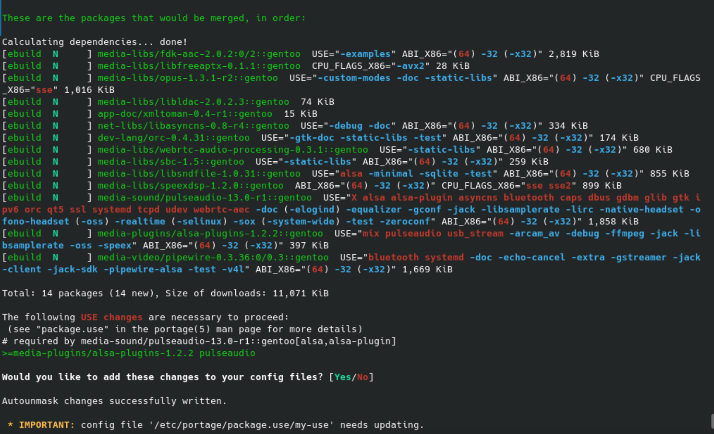
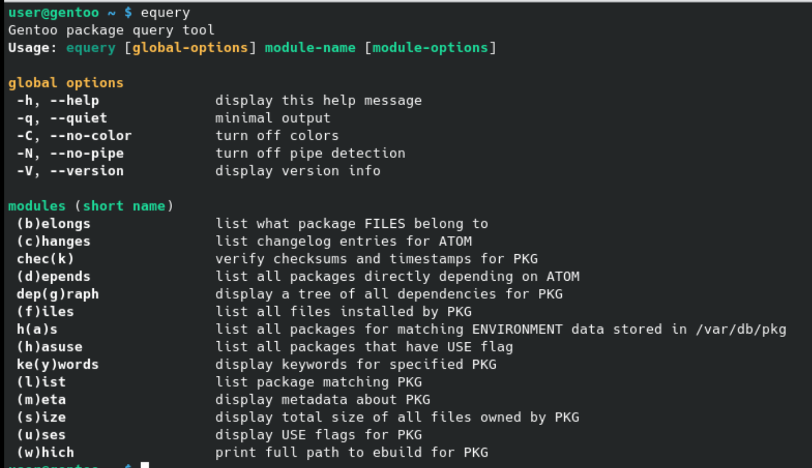

Todos estos pasos se harán una vez reiniciado el sistema y hayamos iniciado sesión.

## Limpiar emerge

Para limpiar los paquetes que no son necesarios después de la instalación:

```sh
sudo emerge --depclean
```

También desactivaremos el uso de paquetes binarios de forma global en `/etc/portage/make.conf`, quitando las opciones `--binpkg-respect-use=y --getbinpkg=y`. Si necesitamos algún paquete binario en el futuro, o cuando hagamos una actualización rutinaria, podemos volver a usar las opciones anteriores pasándolas directamente como argumentos a emerge.


## USE flags

Las USE flags son una característica fundamental de Gentoo. Son variables que se pueden desactivar o activar por cada paquete y determinan características que se instalan o no. Las USE flags pueden ser específicas a un paquete (por ejemplo la USE `tk` en el paquete de `python`), o se pueden encontrar en varios paquetes (por ejemplo la USE `wayland`).

Para activar/desactivar las flags, lo podemos hacer con dos archivos:

- En la sección `USE=` en `/etc/portage/make.conf`, y se aplican a todos los paquetes del sistema.
- En `/etc/portage/package.use/<cualquier nombre>`, donde se guardan línea a línea con `<nombre del paquete> <USE flags>`

Es recomendable manter un `package.use` personal y otro en el que escriba portage, así que le creamos uno con mínima prioridad:

```sh
sudo touch /etc/portage/package.use/zz-autounmask
```


## Autounmask

Cuando queramos instalar un paquete que necesite ciertas USE flags de otros paquetes, portage nos pedirá que las activemos. Algunas veces necesitamos añadir `--autounmask`. Para la instalación en la siguiente sección de pipewire, portage nos pedirá lo siguiente:



Al aceptar los cambios, debemeos ejecutar `sudo dispatch-conf`, pulsar `u` para aceptarlos. Una vez `alsa-plugins` obtiene esa USE flags, `pipewire` se podrá instalar.

## Audio

Para tener audio, instalaremos Pipewire. Es el nuevo sistema de sonido que reemplazará a pulseudio.

```sh
sudo emerge pipewire plasma-pa
systemctl --user enable pipewire.socket pipewire-media-session.service
systemctl mask pulseaudio.socket pulseaudio.service
reboot
```

## Eix

Eix es una aplicación que sirve para actualizar la base de datos y buscar en ella.
Para actualizar nuestro paquetes, antes de actualizar el sistema, usamos:

```sh
sudo eix-sync
```

Para buscar un paquete con eix:

```sh
eix <nombre>
```

## Actualizar el sistema

Para actualizar el sistema, primero actualizamos la base de datos y después instalamos @world (todos los paquetes). Si volvemos a añadir `--getbinpkg` podemos usar paquetes binarios.

```sh
sudo eix-sync
sudo emerge --update --deep --newuse [--getbinpkg] @world
```

## Equery

Junto con `eix`, `equery` es un comando fundamental que sirve para obtener información de los paquetes:



## Keywords y slots
